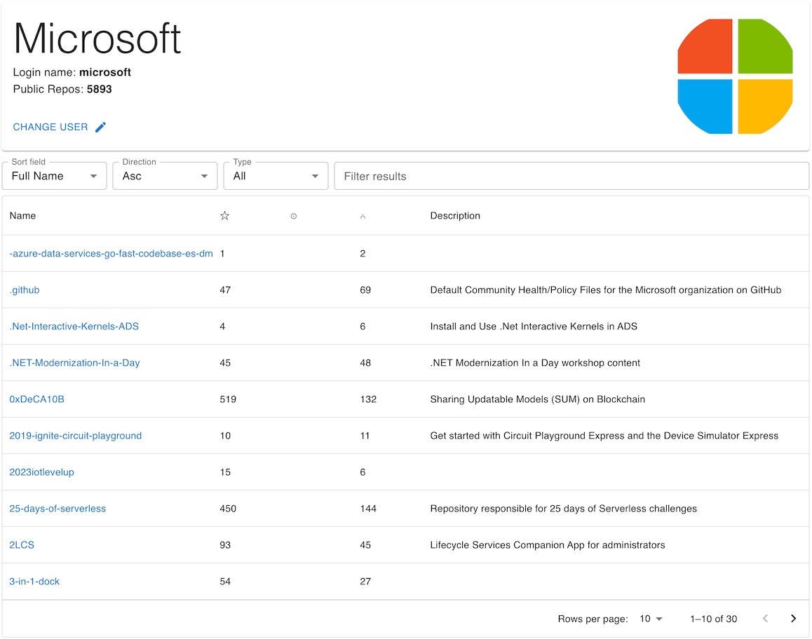

# Github Repos Browser

This project implements a simple browser for Github repositories for a give user.



## Details

### Preview

This project is deployed at
[Github Pages](https://rehangit.github.io/github-repos-browser/)

### Features

- Lists the public repositories with simple details for a given user in a tabular form
- Allows adjusting fetching from github using sorting and pagination
- Uses grid controls for pagination, sorting and filtering of the downloaded results

### Features wish list

- Implement full server side query and filtering

## Technical Details

- **Use of Github API** Currently the project uses the Github Repository API [`GET /repositories`](https://docs.github.com/en/rest/repos/repos?apiVersion=2022-11-28#list-public-repositories) to download a bunch of Github repositories up to 100 at a time. The user details are also accessed using `GET /users` API.
- **Sorting & Filtering** The three parameters of the API are customisable: `Type`, `Sort` and `Direction` from the UI. When a new value is selected from the drop down the results are automatically refreshed.
- **Local Caching**: It caches the recent query results in local memory cache for efficient reload and saving with the Github API quota limits.
- **Debug logs**: The logging can be enabled by adding a flag `DEBUG_LEVEL` with value `DEBUG` to Local Storage.

## Development

This project is scaffoled using vite and uses Typescript & React. Linting is configured with **eslint**.

### Install and Build

```
npm i
npm run lint
npm run build
```

### Deployment

It features automatic deployment (CI/CD) on every push to master branch using Github Actions workflow [./.github/workflows/deploy.yml](./.github/workflows/deploy.yml).
